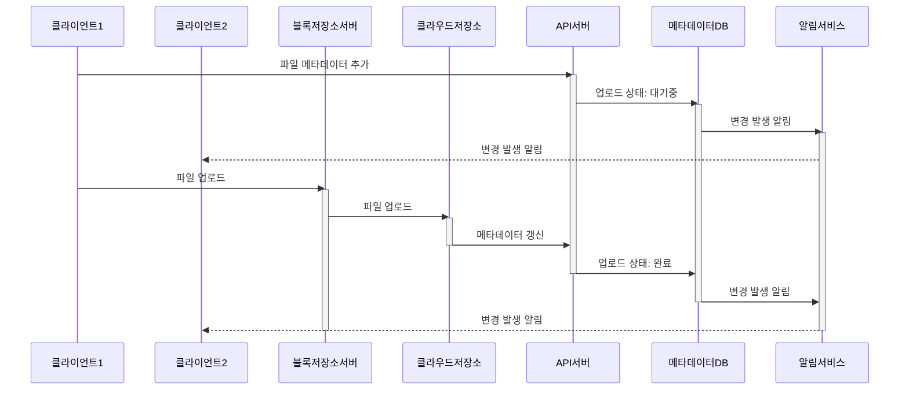
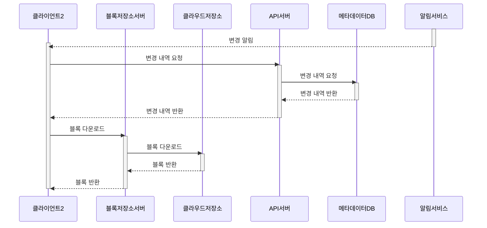

## 문제 이해 및 설계 범위 확정
- 설계 분석
	- 도메인 기능
		- 파일 업로드/다운로드, 동기화, 알림
	- 플랫폼 지원 여부
	- 암호화 지원 여부
	- DAU
## 개략적 설계안 제시 및 동의 구하기
- 모놀리스 구성에서 확장하는 방식 적용
	- 파일 업로드/다운로드 서버
	- 메타데이터 보관 DB
	- 파일 저장 시스템
### API
#### 파일 업로드 API
- 단순 업로드: 파일 사이즈가 작은 경우
- 이어 올리기: 파일 사이즈가 크고 네트워크 문제로 업로드가 중단될 가능성이 높은 경우
	1. 이어 올리기 URL을 받기 위한 최초 요청 전송
	2. 데이터 업로드 및 상태 모니터링
	3. 장애가 발생하면 장애 발생 시점부터 재시작
#### 파일 다운로드 API
- 다운로드할 파일 경로 인자 필요
#### 파일 갱신 히스토리 API
- 파일 갱신 히스토리를 가져올 파일 경로와 최대치 길이 제한 필요
### 한 대 서버의 제약 극복
- 업로드 파일 증가 → 파일 시스템 확장 필요
- 데이터 샤딩을 활용해 저장 파일 분담
- 데이터 다중화 필요 → 데이터 손실 방지 및 가용성 보장 
	- AWS S3 다중화 이용
- 로드밸런서 도입 및 시스템 확장
### 동기화 충돌
- 다중 사용자가 동시에 업데이트 하는 경우 동기화 충돌 발생
- 먼저 처리되는 변경을 성공으로 → 이후 처리된 변경은 충돌로 표시
### 개략적 설계안

	- 사용자 단말: 사용자
	- 블록 저장소 서버: 파일 블록을 클라우드 저장소에 업로드하는 서버
		- 파일을 여러개의 블록으로 나눠 저장 → 파일에는 고유 해시 할당
		- 독립적인 객체로 간주되며 클라우드에 저장됨
		- 파일 재구성시 블록들을 원래 순서대로 합쳐야함
	- 클라우드 저장소: 파일 블록 저장 위치
	- 아카이빙 저장소: 오랫동안 사용하지 않은 비활성 데이터 저장 시스템
	- 로드밸런서: API 요청 분산
	- API 서버: 파일 업로드 외 요청 처리
	- 메타데이터 DB: 메타데이터 저장
	- 메타데이터 캐시: 자주 접근하는 메타데이터 캐싱
	- 알림 서비스: 파일 추가, 편집, 삭제 알림 전송을 위한 pub/sub 기반 시스템
	- 오프라인 사용자 백업 큐: 클라이언트가 미접속중일 때 동기화 대기용 큐
## 상세 설계
### 블록 저장소 서버
- 정기적으로 갱신되는 파일을 업데이트가 발생할 때마다 업로드하면 네트워크 대역폭을 많이 점유함
	- 델타 동기화: 수정한 파일 블록만 동기화
	- 압축: 블록 단위 압축을 진행해 데이터 크기 자체를 줄이기
- 블록 저장소 서버에서 파일 블록 나누기 → 압축 알고리즘 적용 → 암호화 → 수정된 블록만 전송해야함
### 높은 일관성 요구사항
- 강한 일관성 모델을 기본으로 지원
	- 같은 파일이 단말이나 사용자에 따라 다르게 보이면 안됨
- 강한 일관성을 지원하기 위해서는
	- 캐시에 보관된 사본과 DB에 보관된 원본이 일치
	- DB 원본에 변경이 발생하면 캐시 무효화
### 메타데이터 데이터베이스

### 업로드 절차

### 다운로드 절차

### 알림 서비스
- 파일 일관성 유지를 위해 클라이언트는 로컬에서 파일이 수정되었음을 감지하는 순간 다른 클라이언트에 알려야함
	- 롱 폴링
	- 웹 소캣
- 알림 서비스에 양방향 통신이 필요하지 않고 알림 전송이 잦지 않아 롱 폴링 채택
	- 알림 서버와 롱 폴링 연결을 유지하다가 특정 파일 변경이 감지되면 연결 해제
	- **반드시** 메타데이터 서버와 연결해 최신 내역 다운로드 필요
### 저장소 공간 절약
- 중복 제거
	- 파일 블록 해시를 비교해 중복된 파일 블록 제거
- 지능적 백업 전략
	- 보관 한도 설정 및 중요한 버전만 보관
- 아카이빙 저장소 활용
	- 자주 쓰이지 않는 데이터에 대한 아카이빙
### 장애 처리
- 로드밸런서 장애
- 블록 저장소 서버 장애
- 클라우드 저장소 서버 장애
- API 서버 장애
- 메타데이터 캐시 장애
- 메타데이터 DB 장애
- 알림 서비스 장애
