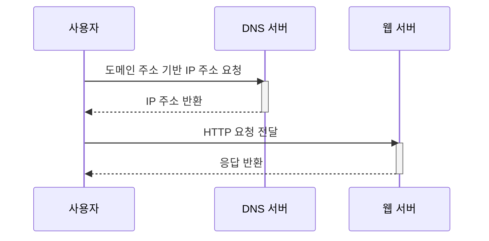

## 단일 서버
- 모든 컴포넌트가 단 한 대의 서버에서 실행되는 간단한 시스템
### 사용자 요청 처리 과정 살펴보기

### 실제 요청의 종류 (사용자의 종류)
- 웹 앱: 비즈니스 로직, 데이터 저장을 처리하기 위해서는 서버 구현용 언어(Java, Python 등)를 프레젠테이션용으로는 클라이언트 구현용 언어(HTML, JS)를 사용
- 모바일 앱: 웹 서버간 통신을 위해 JSON 형식의 HTTP 프로토콜을 사용

## 데이터베이스
- 단일 서버 사용자가 증가 → 서버 분리 필요
	- 웹/모바일 트래픽 처리 서버(웹 계층)과 데이터베이스 서버(데이터 계층)으로 분리 → 독립적 확장 가능
### 어떤 데이터베이스를 사용할 것인가?
- Relational Database
	- 자료를 테이블과 열, 칼럼으로 표현
	- SQL 활용을 통한 관계 JOIN 가능
	- MySQL, Oracle DB, PostgreSQL
	- 선택하는 경우
		- 일반적인 경우
		- 정형 데이터
		- 데이터간의 관계가 명확한 경우
- NoSQL Database
	- key-value store, graph store, column store, document store로 구분
	- MongoDB, Cassandra, Redis
	- 선택하는 경우
		- 아주 낮은 응답 지연시간이 요구됨
		- 비정형 데이터
		- 직렬화 역직렬화만 필요한 데이터
		- 아주 많은 양의 데이터를 저장할 때

## 수직적 규모 확장 vs 수평적 규모 확장
- 수직적 규모 확장(scale up)
	- 서버에 고사양 자원을 추가하기
	- 단순함
	- 확장의 한계가 존재
	- 자동 복구나 다중화 방안이 제시되지 않음
	- 장애가 발생하면 완전 중단
- 수평적 규모 확장(scale out)
	- 더 많은 서버를 추가하기
	- 대규모 애플리케이션을 지원하는데 적절함
- 웹 서버가 사용자에 직접 연결되면 너무 많은 사용자가 접속하거나 서버에 이상이 생기면 정상 응답이 어려움
	- 해결방안: [[1장. 사용자 수에 따른 규모 확장성#로드밸런서|로드밸런서]] 또는 부하 분산기 도입
### 로드밸런서
- 부하 분산 집합에 속한 웹 서버들에게 트래픽 부하를 고르게 분산하는 역할
	```mermaid
	sequenceDiagram
		participant 사용자
		participant DNS 서버
		participant 로드밸런서
		participant 웹 서버
	
		사용자->>DNS 서버: 도메인 주소 기반 IP 주소 요청
		activate DNS 서버
		DNS 서버-->>사용자: IP 주소 반환 
		deactivate DNS 서버
		사용자->>로드밸런서: HTTP 요청 전달
		activate 로드밸런서
		로드밸런서->>웹 서버: 부하 분산 및 요청 전달
		activate 웹 서버
		웹 서버-->>로드밸런서: 응답 반환
		deactivate 웹 서버
		로드밸런서-->>사용자: 응답 반환
		deactivate 로드밸런서
	```
- 사용자는 로드밸런서의 공개 IP 주소로 접근
	- 서버간 통신에는 사설 IP 이용 → 인터넷 접근 불가
- 장애 자동복구 해결 및 가용성 향상
	- 서버를 여러 대 사용할 수 있어 하나의 서버가 다운되도 다른 서버로 트래픽 전송 가능
	- 트래픽이 가파르게 증가하는 경우 서버를 추가하기만 하면 됨

### 데이터베이스 다중화
- master-slave
	- 관계를 설정하고 데이터 원본을 주 서버, 사본을 부 서버에 저장해 분산
	- 쓰기 연산은 마스터에만 읽기 연산은 부 서버에서만 지원
	- 장점:
		- 읽기 연산의 병렬 처리
		- 안정성: DB 서버 일부 누실되도 데이터 보존
		- 가용성 보장: 장애 발생시 서비스 유지 가능

## 캐시
- 자주 참조되는 데이터를 메모리 안에 두고, 뒤이은 요청이 보다 빨리 처리될 수 있도록 하는 저장소

### 캐시 계층
- 데이터가 잠시 보관되는 곳
- 읽기 주도형 캐시 전략
	- 요청에 대해 웹 서버는 캐시를 먼저 조회하고 존재하지 않는다면 DB 조회 후 응답 반환

### 캐시 사용 시 유의할 점
- 데이터 갱신이 자주 일어나지 않지만 참조가 많은 경우 캐시 사용을 고려하기
- 캐시 == 휘발성 메모리: 영속적으로 보관할 데이터는 캐시에 두는 것이 바람직하지 않다
- 적절한 캐시 만료 정책 수립 필요
- 캐시 일관성 고려하기
- SPOF가 되지 않도록 캐시 분산 필요
- 캐시 Eviction을 줄이기 위한 캐시 메모리 크기 고려
- Eviction 정책 고려: LRU, LFU, FIFO 등

## CDN
- **static content** 전송을 위해 사용하는 **지리적으로 분산된 서버의 네트워크**
	- 이미지, 비디오, CSS, JavaScript, etc...
- Request Path, Query String, Cookie, Request Header 등의 정보에 기반해 HTML 페이지 캐시
- 사용자가 웹사이트에 방문하면 가장 가까운 CDN 서버가 정적 콘텐츠를 전달
- 동작 과정
	```mermaid
	sequenceDiagram
		participant 사용자
		participant CDN
		participant 서버
	
		사용자->>CDN: 이미지 URL을 이용해 접근
		activate CDN
		CDN->>서버: (이미지가 없는 경우) 파일 요청
		activate 서버
		서버-->>CDN: 파일 반환
		deactivate 서버
		CDN-->>사용자: 응답 반환
		deactivate CDN
	```
### CDN 사용 시 고려해야할 사항
- 비용: 자주 사용되지 않는 콘텐츠를 캐싱하는 것은 비용적인 측면에서 손해임
- 적절한 만료: 시의성을 고려해야하는 콘텐츠의 만료 시점을 잘 정해야 함
- 장애 대처: CDN 장애 발생시 동작 방식 고려

## 무상태(stateless) 웹 계층
- 웹 계층의 수평적 확장을 위해 사용자 상태 정보를 지속성 저장소에 보관해 필요할 때 사용하도록 구성
### 상태 정보 의존적인 아키텍처
- 서버에서 클라이언트 정보(상태)를 유지해 요청 사이에 공유됨
- A 서버에 상태가 저장되어 있을 때 B 서버에 요청이 전달되면 인증 실패
	- 같은 클라이언트로부터 요청은 항상 같은 서버로 전송되어야 함 → sticky session
### 무상태 아키텍처
- 서버는 상태 정보가 필요한 경우 서버 간 공유되는 **공유 저장소**로부터 데이터를 가져와 활용
	- 상태 정보가 물리적으로 웹 서버와 분리됨
- 같은 클라이언트의 요청이 여러 서버로 전송되어도 상관 없음

## 데이터 센터
- (장애가 없는 상황에서) 사용자는 가장 가까운 데이터 센터의 서버에 접속됨 → 지리적 라우팅
- 장애가 발생한다면 모든 트래픽은 장애가 없는 데이터 센터로 전송
- 다중 데이터 센터 아키텍처 구성을 위한 기술적 난제
	- 트래픽 우회: 올바른 데이터 센터로 트래픽을 보내는 효과적인 방법 강구
	- 데이터 동기화: 데이터 센터간 데이터 동기화 필요
	- 테스트와 배포: 모든 데이터 센터에 동일한 서비스 설치

## 메시지 큐
- 무손실을 보장하는 비동기 통신을 지원하는 컴포넌트
	- 무손실(durability): 보관된 메시지는 소비자가 꺼낼 때까지 안전하게 보관됨
- 메시지의 버퍼 역할을 하며 비동기 전송 기능 지원
- 생산자 - 소비자 아키텍처로 구성
- 서비스 또는 서버 간 결합이 느슨해져 확장성이 보장되어야 하는 안정적 애플리케이션 구상에 장점

## 로그, 메트릭 그리고 자동화
- 로그: 시스템의 오류와 문제를 보다 쉽게 찾기 위한 에러 로그 모니터링
- 메트릭: 시스템 현재 상태 파악 및 사업 현황 집계
	- 호스트 단위 메트릭: CPU, 메모리, 디스크 I/O 등
	- 종합 메트릭: 계층별 성능
	- 핵심 비즈니스 메트릭: 일별 능동 사용자, 수익, 재방문 등
- 자동화: CI/CD 자동화를 통한 생산성 향상

## 데이터베이스의 규모 확장
- 저장할 데이터가 많아지면 DB 부하 증가 → 해결 방법 필요
### 수직적 확장
- 기존 서버 자원 증설
- 문제점
	- 서버 하드웨어에 한계가 존재해 확장의 한계가 존재
	- SPOF 위험성
	- 자원 증설에 따른 비용 증가

### 수평적 확장
- 더 많은 서버를 추가함으로써 성능 향상
- 샤딩
	- 대규모 데이터베이스를 **샤드** 단위로 분할
	- 모든 샤드는 같은 스키마를 사용하지만 샤드에 보관되는 데이터 사이에는 중복이 없음
- **샤딩 키**를 정하는 방식이 샤딩 전략을 구현할 때 고려해야할 가장 중요한 점
- 문제점
	- 데이터의 재 샤딩: 데이터가 너무 많아지거나 분포가 균등하지 않은 경우 데이터 재 배치 필요
	- 유명인사 문제: 특정 샤드에 질의가 집중되어 발생하는 문제
	- JOIN과 비정규화: 여러 샤드에 걸친 데이터 조인이 어려움 → 비정규화를 통한 하나의 테이블에서의 질의 수행

## 백만 사용자, 그리고 그 이상
- 시스템 규모 확장을 위한 기법
	- 웹 계층: 무상태 계층
	- 계층 다중화 도입
	- 데이터 캐시
	- 여러 DC 지원
	- static content에 대한 CDN 도입
	- 샤딩을 통한 규모 확장
	- 독립 서비스 분할
	- 지속적 모니터링 및 자동화