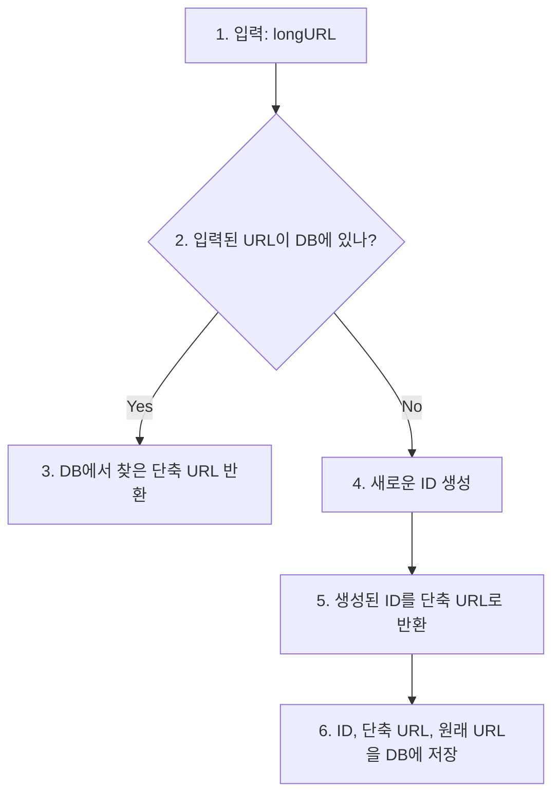

## 문제 이해 및 설계 범위 확정
- 주어진 URL을 단축시켜야 함
- 축약된 URL로 HTTP 요청이 오면 **원래 URL로 안내**
- 높은 가용성과 규모 확장성, 그리고 장애 감내 요구
## 개략적 설계안 제시 및 동의 구하기
### API 엔드포인트
- 클라이언트는 서버가 제공하는 **API 엔드포인트**를 통해 서버와 통신
	- URL 단축용 엔드포인트: 새 단축 URL 생성 엔드포인트
		- ex: `POST /api/v1/data/shorten`
	- URL 리다이렉션용 엔드포인트: 단축 URL 리다이렉션 엔드포인트
		- ex: `GET /api/v1/shortUrl`
### URL 리다이렉션
- 301, 302 응답을 통해 원래 URL로 바꾸어 Location 헤더를 통한 반환
	
- 301(Moved Permanently)
	- 요청한 리소스가 영구적으로 새로운 URL로 이동
	- 브라우저는 응답을 캐싱해 추후 요청에 대해 새로운 URL로 전송
	- 서버 부하 감소에 장점
- 302(Found)
	- 요청한 리소스가 임시로 다른 URL로 이동
	- 브라우저는 언제나 단축 URL 서버에 요청을 먼저 보내고 원래 URL로 리다이렉션
	- 클릭 발생률, 발생 위치 등 트래픽 분석에 유리
### URL 단축
- 긴 URL을 해시 값으로 대응시킬 함수를 찾아야 함
	- 입력으로 주어진 값이 다르면 항상 해시 값도 달라야 함
	- 해시 값은 원래 입력으로 주어진 값으로 복원될 수 있어야 함
## 상세 설계
### 데이터 모델
- <단축 URL, 원래 URL> 순서쌍을 DB에 저장하는 방식
### 해시 함수
- 원래 URL → 단축 URL 변환용
#### 해시 값 길이
- \[0-9, a-z, A-Z\] 값만 해시에 사용한다고 가정
- 길이가 7인 해시를 사용하면 약 3.5개의 URL을 만들 수 있음
#### 해시 후 충돌 해소
- 잘 알려진 해시 함수를 사용한 경우 모두 길이가 7 이상인 해시를 만들어 줌
- 계산된 해시 값에서 앞에 7글자만 사용한다면? → 해시 충돌 가능성이 높음
	- 충돌 확인(DB 조회) 후 값 증가하는 방식은? → DB 오버해드가 높아져요..
	```mermaid
	flowchart TD
		A((시작))
		B[입력:longURL]
		C[해시 함수]
		D[shortURL]
		E{DB에 있나?}
		F[DB에 저장]
		G[longURL 뒤에 사전에 정한 문자열 추가]
		H((종료))
	
		A-->B
		B-->C
		C-->D
		D-->E
		E-->|Yes\n충돌 발생|G
		G-->B
		E-->|No|F
		F-->H
	```
#### base-62 변환
- 62진법을 사용해 진수 변환
- `11157_10` → `2TX_62`
#### 두 접근법 비교

| 해시 후 충돌 해소 전략                  | base-62 변환                          |
| :----------------------------- | ----------------------------------- |
| 단축 URL의 길이가 고정됨                | 단축 URL의 길이가 가변적. ID 값이 커지면 같이 커짐    |
| 유일성이 보장되는 ID 생성기가 필요하지 않음      | 유일성 보장 ID 생성기 필요                    |
| 충돌이 가능해서 해소 전략이 필요             | 충돌 가능성 X                            |
| 다음에 쓸 수 있는 단축 URL을 알아내는 것이 불가능 | 다음에 쓸 수 있는 단축 URL 예측 가능 → 보안 문제 가능성 |
### URL 단축기 상세 설계

### URL 리다이렉션 상세 설계
- 단축기라는 도메인 특성상 **쓰기보다 읽기를 더 자주 하는 시스템**이라 캐시를 활용해 성능 향상
- 동작과정
	1. 사용자가 단축 URL 클릭
	2. 로드밸런서가 해당 클릭으로 발생한 요청을 웹 서버에 전달
	3. 단축 URL이 이미 캐시에 있는 경우 원래 URL을 바로 전달
	4. 캐시에 존재하지 않으면 DB 조회 후 결과 반환
	5. (만약 정상 요청이라면) 캐시 갱신
## 마무리
- 추가적으로 고려하면 좋은 것들
	- 처리율 제한 장치
	- 웹 서버의 규모 확장
	- DB 규모 확장
	- 데이터 분석 솔루션
	- 가용성, 데이터 일관성, 안정성